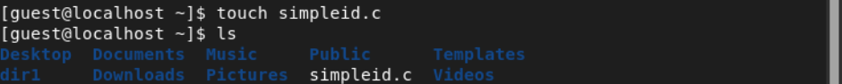

---
## Front matter
lang: ru-RU
title: Дискреционное разграничение прав в Linux. Исследование влияния дополнительных атрибутов
author: |
	 Венчаков Никита Юрьевич\inst{1}

institute: |
	\inst{1}Российский университет дружбы народов, Москва, Россия

date: 3 октября, 2022

## Formatting
mainfont: PT Serif
toc: false
slide_level: 2
theme: metropolis
header-includes: 
 - \metroset{progressbar=frametitle,sectionpage=progressbar,numbering=fraction}
 - '\makeatletter'
 - '\beamer@ignorenonframefalse'
 - '\makeatother'
aspectratio: 43
section-titles: true
---
## Докладчик

  * Венчаков Никита Юрьевич

  * студент 4 курса

  * Студенческий билет: 1032196697

  * группа НБИбд-01-19

  * Российский университет дружбы народов

  * [venchakov2001@gmail.com](mailto:venchakov2001@gmail.com)

    

---

## Введение
### Цель работы

Изучение механизмов изменения идентификаторов, применения SetUID- и Sticky-битов. Получение практических навыков работы в консоли с дополнительными атрибутами. Рассмотрение работы механизма смены идентификатора процессов пользователей, а также влияние битаSticky на запись и удаление файлов.

## Выполнение лабораторной работы

1. Создал программу simpleid.c: ([рис.№1](Скриншоты выполнения\Создание файла simpleid.png))
{ #fig:001 width=70% height=70% }

## Программа simpleid2

2. Усложнил программу, добавив вывод действительных идентификаторов.Скомпилировал и запустил simpleid2.c:([рис.№2](Скриншоты выполнения\Компилирование и выполнение simpleid2.png))
{ #fig:002 width=70% height=70% }

## Добавление SETUID
3.  От имени суперпользователя выполните команды: 
chown root:guest /home/guest/simpleid2,  chmod u+s /home/guest/simpleid2 ([рис.№3](Скриншоты выполнения\Изменение прав simpleid2.png))
{ #fig:003 width=70% height=70% }

## Изменение права readfile
4. Сменил владельца у файла readfile.c на vnikikita и изменил права так, чтобы только суперпользователь мог прочитать его, a guest не мог.([рис.№4](Скриншоты выполнения\Смена пользователя readfile.png))
{ #fig:004 width=70% height=70% }

## SETGID
5. Проделал теже самые пункты с SETUID  относительно SetGID-бита. ([рис.№5](Скриншоты выполнения\SETGid.png))
{ #fig:005 width=70% height=70% }

## Создание файла file01 в директории tmp
6. От имени пользователя guest создал файл file01.txt в директории /tmp
со словом test: ([рис.№6](Скриншоты выполнения\Запись в tmp.png))
{ #fig:015 width=70% height=70% }

## Изменение прав доступа file01 
7. Просмотрел атрибуты у только что созданного файла и разрешил чтение и запись для категории пользователей «все остальные»: ls -l /tmp/file01.txt
chmod o+rw /tmp/file01.txt
ls -l /tmp/file01.txt ([рис.№7](Скриншоты выполнения\Изменение прав readfile.png))
{ #fig:007 width=70% height=70% }

## Без sticky 
8. Повторил предыдущие шаги без без sticky-бита(без атрибута t) ([рис.№8](Скриншоты выполнения\Часть 2 без sticky.png))
{ #fig:008 width=70% height=70% }

## Вывод
Получил практические навыки работы в консоли с расширенными атрибутами файлов.