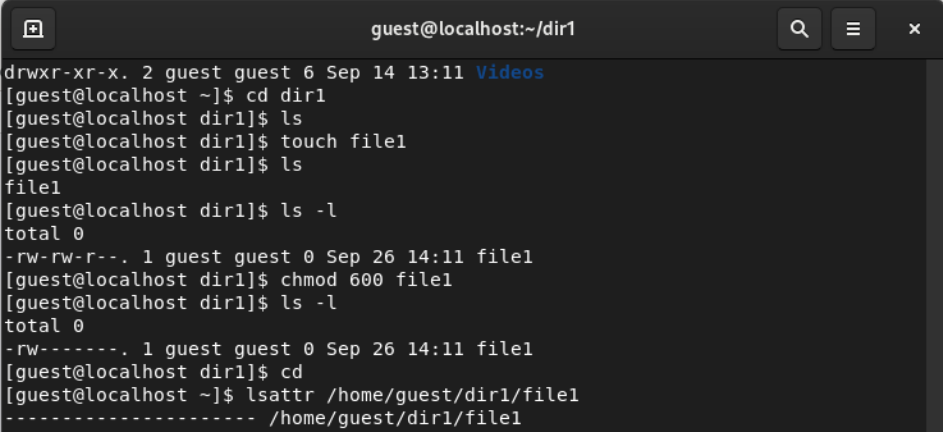

## Front matter
lang: ru-RU
title: Дискреционное разграничение прав в Linux. Расширенные атрибуты
subtitle:
author:
  - Венчаков Никита Юрьевич
institute:
  - Российский университет дружбы народов, Москва, Россия
date: 26 сентября 2022

## i18n babel
babel-lang: russian
babel-otherlangs: english

## Formatting pdf
toc: false
toc-title: Содержание
slide_level: 2
aspectratio: 169
section-titles: true
theme: metropolis
header-includes:
 - \metroset{progressbar=frametitle,sectionpage=progressbar,numbering=fraction}
 - '\makeatletter'
 - '\beamer@ignorenonframefalse'
 - '\makeatother'

## Fonts
mainfont: PT Serif
romanfont: PT Serif
sansfont: PT Sans
monofont: PT Mono
mainfontoptions: Ligatures=TeX
romanfontoptions: Ligatures=TeX
sansfontoptions: Ligatures=TeX,Scale=MatchLowercase
monofontoptions: Scale=MatchLowercase

---

## Докладчик

  * Венчаков Никита Юрьевич

  * студент 4 курса

  * Студенческий билет: 1032196697

  * группа НБИбд-01-19

  * Российский университет дружбы народов

  * [venchakov2001@gmail.com](mailto:venchakov2001@gmail.com)

    

---

## Введение
### Цель работы

Получение практических навыков работы в консоли с расширенными атрибутами файлов.

## Выполнение лабораторной работы

1. От имени пользователя guest определил расширенные атрибуты файла
/home/guest/dir1/file1 командой lsattr /home/guest/dir1/file1. ([рис.№1](Скриншоты выполнения\Просмотр прав file1.png))
{ #fig:001 width=70% height=70% }

## Установка расширенного атрибута a на file1
2. Установил на файл /home/guest/dir1/file1 расширенный атрибут a от имени пользователя guest: chattr +a /home/guest/dir1/file1. ([рис.№2](Скриншоты выполнения\ Проверка атрибута.png))
{ #fig:002 width=70% height=70% }

## Проверка атрибута файла file1
3. От пользователя guest проверьте правильность установления атрибута:
lsattr /home/guest/dir1/file1 ([рис.№3](Скриншоты выполнения\Просмотр атрибута.png))
{ #fig:003 width=70% height=70% }

## Попытка изменения файла file1
4. Попробовал перезаписать имеющуюся в file1 информацию командой
echo "abcd" > /home/guest/dirl/file1. Попробовал переименовать файл командой mv.

([рис.№4](Скриншоты выполнения\Переимнование file1.png))
{ #fig:004 width=70% height=70% }

## Снятие расширенного атрибута а
5. Снял расширенный атрибут a с файла /home/guest/dirl/file1 от имени суперпользователя командой chattr -a /home/guest/dir1/file1. Повторил операции, которые ранее не удавалось выполнить. Перезаписал test на abcd. ([рис.№5](Скриншоты выполнения\Успешное перезаписывание файла file1.png))
{ #fig:005 width=70% height=70% }

## Удачная изменение file1
6. Переименовал файл в lab04, снял права с пользователя-владельца. ([рис.№6](Скриншоты выполнения\Пункт 9.png))
{ #fig:010 width=70% height=70% }

## Расширенный атрибут i 
7. Повторил действия по шагам, заменив атрибут «a» атрибутом «i». Как и с атрибутом а, все результаты такие же. ([рис.№7](Скриншоты выполнения\Пункт 10 с параметром i.png))
{ #fig:011 width=70% height=70% }

## Вывод
Получил практические навыки работы в консоли с расширенными атрибутами файлов.