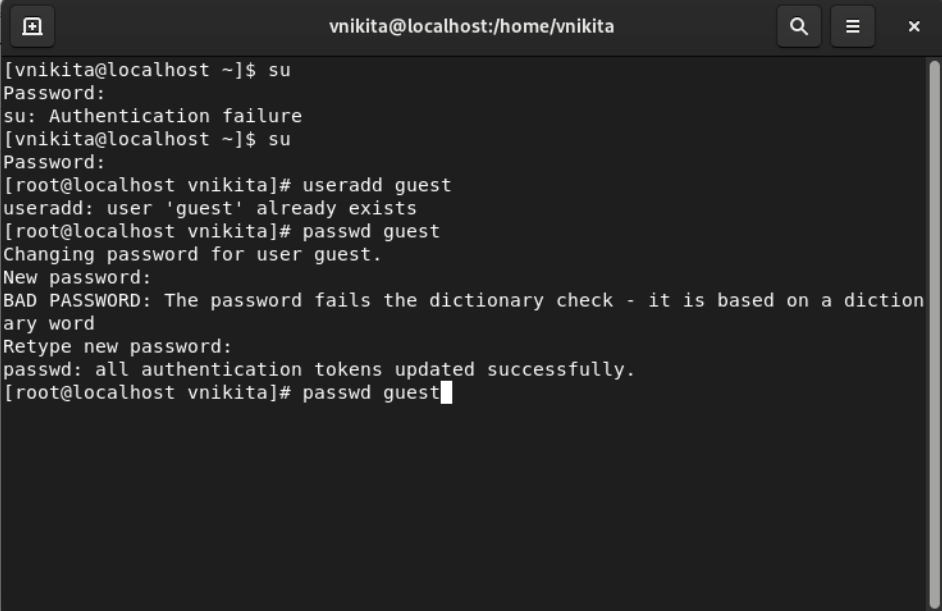

---
# Front matter
lang: ru-RU
title: "Отчёт по лабораторной работе №2"
subtitle: "Дискреционное разграничение прав в Linux. Основные атрибуты"
author: "Венчаков Никита НБИбд-01-19"

## Formatting
toc-title: "Содержание"
toc: true # Table of contents
toc_depth: 2
lof: true # List of figures
fontsize: 12pt
linestretch: 1.5
papersize: a4paper
documentclass: scrreprt
polyglossia-lang: russian
polyglossia-otherlangs: english
mainfont: PT Serif
romanfont: PT Serif
sansfont: PT Sans
monofont: PT Mono
mainfontoptions: Ligatures=TeX
romanfontoptions: Ligatures=TeX
sansfontoptions: Ligatures=TeX,Scale=MatchLowercase
monofontoptions: Scale=MatchLowercase
indent: true
pdf-engine: lualatex
header-includes:
  - \linepenalty=10 # the penalty added to the badness of each line within a paragraph (no associated penalty node) Increasing the value makes tex try to have fewer lines in the paragraph.
  - \interlinepenalty=0 # value of the penalty (node) added after each line of a paragraph.
  - \hyphenpenalty=50 # the penalty for line breaking at an automatically inserted hyphen
  - \exhyphenpenalty=50 # the penalty for line breaking at an explicit hyphen
  - \binoppenalty=700 # the penalty for breaking a line at a binary operator
  - \relpenalty=500 # the penalty for breaking a line at a relation
  - \clubpenalty=150 # extra penalty for breaking after first line of a paragraph
  - \widowpenalty=150 # extra penalty for breaking before last line of a paragraph
  - \displaywidowpenalty=50 # extra penalty for breaking before last line before a display math
  - \brokenpenalty=100 # extra penalty for page breaking after a hyphenated line
  - \predisplaypenalty=10000 # penalty for breaking before a display
  - \postdisplaypenalty=0 # penalty for breaking after a display
  - \floatingpenalty = 20000 # penalty for splitting an insertion (can only be split footnote in standard LaTeX)
  - \raggedbottom # or \flushbottom
  - \usepackage{float} # keep figures where there are in the text
  - \floatplacement{figure}{H} # keep figures where there are in the text
---

# Цель работы

Получение практических навыков работы в консоли с атрибутами файлов, закрепление теоретических основ дискреционного разграничения доступа в современных системах с открытым кодом на базе ОС Linux.


## Задание

1. В установленной при выполнении предыдущей лабораторной работы
операционной системе создайте учётную запись пользователя guest (использую учётную запись администратора):
useradd guest
2. Задайте пароль для пользователя guest (использую учётную запись администратора):
passwd guest
3. Войдите в систему от имени пользователя guest.
4. Определите директорию, в которой вы находитесь, командой pwd. Сравните её с приглашением командной строки. Определите, является ли она
вашей домашней директорией? Если нет, зайдите в домашнюю директорию.
5. Уточните имя вашего пользователя командой whoami.
6. Уточните имя вашего пользователя, его группу, а также группы, куда входит пользователь, командой id. Выведенные значения uid, gid и др. запомните. Сравните вывод id с выводом команды groups.
7. Сравните полученную информацию об имени пользователя с данными,
выводимыми в приглашении командной строки.
8. Просмотрите файл /etc/passwd командой
cat /etc/passwd
Найдите в нём свою учётную запись. Определите uid пользователя.
Определите gid пользователя. Сравните найденные значения с полученными в предыдущих пунктах.
9. Определите существующие в системе директории командой
ls -l /home/
Удалось ли вам получить список поддиректорий директории /home? Какие права установлены на директориях?
10. Проверьте, какие расширенные атрибуты установлены на поддиректориях, находящихся в директории /home, командой:
lsattr /home
Удалось ли вам увидеть расширенные атрибуты директории?
Удалось ли вам увидеть расширенные атрибуты директорий других
пользователей?
11. Создайте в домашней директории поддиректорию dir1 командой
mkdir dir1
Определите командами ls -l и lsattr, какие права доступа и расширенные атрибуты были выставлены на директорию dir1.
12. Снимите с директории dir1 все атрибуты командой
chmod 000 dir1
и проверьте с её помощью правильность выполнения команды
ls -l
13. Попытайтесь создать в директории dir1 файл file1 командой
echo "test" > /home/guest/dir1/file1
Объясните, почему вы получили отказ в выполнении операции по созданию файла?
Оцените, как сообщение об ошибке отразилось на создании файла? Проверьте командой
ls -l /home/guest/dir1
действительно ли файл file1 не находится внутри директории dir1.
14. Заполните таблицу «Установленные права и разрешённые действия»
15. На основании заполненной таблицы определите те или иные минимально необходимые права для выполнения операций внутри директории
dir1, заполните табл. 2.2.

# Выполнение лабораторной работы

1. Запустил Virtual Box и вошел в свою учетную запись ([рис. №1](Скриншоты выполнения\Вход в учетную запись.png))


2. В установленной при выполнении предыдущей лабораторной работы
операционной системе создал учётную запись пользователя guest (использую учётную запись администратора) с помощью команды useradd guest. Также здесь задал пароль учетной записи "guest" при помощи команды passwd guest ([рис. №2](Скриншоты выполнения\Создание пользователя гость.png)) 


3. Вошел в систему от имени пользователя guest ([рис. №3](Скриншоты выполнения\Смена пользователя.png))
   

4. Определил директорию, в которой вы находился, командой pwd. Понял что эта домашняя аудитория, так как при переходе по пути мы остались в той же директории([рис. №4](Скриншоты выполнения\Проверка директории.png))
   

5. Уточнил имя пользователя командой whoami.([рис. №5](Скриншоты выполнения\Проверка имени пользователя.png))
   

6. Уточнил имя пользователя,группу, а также группы, куда входит пользователь, командой id. Сравните вывод id с выводом команды groups. Обе команды показывают, что guest находится в группе guest ([рис. №6](Скриншоты выполнения\id и groups гость.png))
   

7. Сравнил полученную информацию об имени пользователя с данными,
выводимыми в приглашении командной строки. Они совпадают, так как uid и gid равны 1001.

8. Просмотрел файл /etc/passwd командой cat /etc/passwd
   Нашел в нём свою учётную запись. Определил uid пользователя.
   Определил gid пользователя. Сравните найденные значения с полученными в предыдущих пунктах. Ответ: они одинаковы ([рис. №7](Скриншоты выполнения\проверка uid и gid.png))
   
9. Определил существующие в системе директории командой
ls -l /home/ ([рис. №8](Скриншоты выполнения\Просмотр поддиректорий.png))


10. Проверил, какие расширенные атрибуты установлены на поддиректориях, находящихся в директории /home, командой:lsattr /home ([рис. №9](Скриншоты выполнения\просмотр расширенных атрибутов.png))
    

11. Создал в домашней директории поддиректорию dir1 командой
mkdir dir1. Определил командами ls -l и lsattr, какие права доступа и расширенные атрибуты были выставлены на директорию dir1. Для dir1 стоят почти максимальные права, кроме права на изменение другими пользователями. ([рис. №10](Скриншоты выполнения\Папка dir1.png))
    

12. Снимим с директории dir1 все атрибуты командой chmod 000 dir1 ([рис. №11](Скриншоты выполнения\Снятие прав доступа с dir1.png))
    

13. Попытался создать в директории dir1 файл file1 командой 
    echo "test" > /home/guest/dir1/file1, это не получилось, так как в прошлом пункте мы убрали все права доступа. При проверке файла разумеется нет в директории. ([рис. №12](Скриншоты выполнения\Создание тестового файла.png))
    

При проверке файла разумеется нет в директории. Проверяли командой ls -l /home/guest/dir1 ([рис. №13](Скриншоты выполнения\Просмотр тестового файла.png))
    

14. Заполнил таблицу «Установленные права и разрешённые действия»
[-@tbl:avoid]

|Права директории|Права файла|Соз- дание файла|Уда- ление файла|Запись в файл|Чтение файла|Смена дирек- тории|Просмотр файлов в директории|Пере- имено- вание файла|Смена атри- бутов файла|
|:---|:---       |---|---|---|---|---|---|---|---|
|```d---------(000)```|```----------(000)```|-|-|-|-|-|-|-|-|
|```d--x------(100)```|```----------(000)```|-|-|-|-|+|-|-|+|
|```d-w-------(200)```|```----------(000)```|-|-|-|-|-|-|-|-|
|```d-wx------(300)```|```----------(000)```|+|+|-|-|+|-|+|+|
|```dr--------(400)```|```----------(000)```|-|-|-|-|-|-|-|-|
|```dr-x------(500)```|```----------(000)```|-|-|-|-|+|+|-|+|
|```drw-------(600)```|```----------(000)```|-|-|-|-|-|-|-|-|
|```drwx------(700)```|```----------(000)```|+|+|-|-|+|+|+|+|
|```d---------(000)```|```---x------(100)```|-|-|-|-|-|-|-|-|
|```d--x------(100)```|```---x------(100)```|-|-|-|-|+|-|-|+|
|```d-w-------(200)```|```---x------(100)```|-|-|-|-|-|-|-|-|
|```d-wx------(300)```|```---x------(100)```|+|+|-|-|+|-|+|+|
|```dr--------(400)```|```---x------(100)```|-|-|-|-|-|-|-|-|
|```dr-x------(500)```|```---x------(100)```|-|-|-|-|+|+|-|+|
|```drw-------(600)```|```---x------(100)```|-|-|-|-|-|-|-|-|
|```drwx------(700)```|```---x------(100)```|+|+|-|-|+|+|+|+|
|```d---------(000)```|```--w-------(200)```|-|-|-|-|-|-|-|-|
|```d--x------(100)```|```--w-------(200)```|-|-|+|-|+|-|-|+|
|```d-w-------(200)```|```--w-------(200)```|-|-|-|-|-|-|-|-|
|```d-wx------(300)```|```--w-------(200)```|+|+|+|-|+|-|+|+|
|```dr--------(400)```|```--w-------(200)```|-|-|-|-|-|-|-|-|
|```dr-x------(500)```|```--w-------(200)```|-|-|+|-|+|+|-|+|
|```drw-------(600)```|```--w-------(200)```|-|-|-|-|-|-|-|-|
|```drwx------(700)```|```--w-------(200)```|+|+|+|-|+|+|+|+|
|```d---------(000)```|```--wx------(300)```|-|-|-|-|-|-|-|-|
|```d--x------(100)```|```--wx------(300)```|-|-|+|-|+|-|-|+|
|```d-w-------(200)```|```--wx------(300)```|-|-|-|-|-|-|-|-|
|```d-wx------(300)```|```--wx------(300)```|+|+|+|-|+|-|+|+|
|```dr--------(400)```|```--wx------(300)```|-|-|-|-|-|-|-|-|
|```dr-x------(500)```|```--wx------(300)```|-|-|+|-|+|+|-|+|
|```drw-------(600)```|```--wx------(300)```|-|-|-|-|-|-|-|-|
|```drwx------(700)```|```--wx------(300)```|+|+|+|-|+|+|+|+|
|```d---------(000)```|```-r--------(400)```|-|-|-|-|-|-|-|-|
|```d--x------(100)```|```-r--------(400)```|-|-|-|+|+|-|-|+|
|```d-w-------(200)```|```-r--------(400)```|-|-|-|-|-|-|-|-|
|```d-wx------(300)```|```-r--------(400)```|+|+|-|+|+|-|+|+|
|```dr--------(400)```|```-r--------(400)```|-|-|-|-|-|-|-|-|
|```dr-x------(500)```|```-r--------(400)```|-|-|-|+|+|+|-|+|
|```drw-------(600)```|```-r--------(400)```|-|-|-|-|-|-|-|-|
|```drwx------(700)```|```-r--------(400)```|+|+|-|+|+|+|+|+|
|```d---------(000)```|```-r-x------(500)```|-|-|-|-|-|-|-|-|
|```d--x------(100)```|```-r-x------(500)```|-|-|-|+|+|-|-|+|
|```d-w-------(200)```|```-r-x------(500)```|-|-|-|-|-|-|-|-|
|```d-wx------(300)```|```-r-x------(500)```|+|+|-|+|+|-|+|+|
|```dr--------(400)```|```-r-x------(500)```|-|-|-|-|-|-|-|-|
|```dr-x------(500)```|```-r-x------(500)```|-|-|-|+|+|+|-|+|
|```drw-------(600)```|```-r-x------(500)```|-|-|-|-|-|-|-|-|
|```drwx------(700)```|```-r-x------(500)```|+|+|-|+|+|+|+|+|
|```d---------(000)```|```-rw-------(600)```|-|-|-|-|-|-|-|-|
|```d--x------(100)```|```-rw-------(600)```|-|-|+|+|+|-|-|+|
|```d-w-------(200)```|```-rw-------(600)```|-|-|-|-|-|-|-|-|
|```d-wx------(300)```|```-rw-------(600)```|+|+|+|+|+|-|+|+|
|```dr--------(400)```|```-rw-------(600)```|-|-|-|-|-|-|-|-|
|```dr-x------(500)```|```-rw-------(600)```|-|-|+|+|+|+|-|+|
|```drw-------(600)```|```-rw-------(600)```|-|-|-|-|-|-|-|-|
|```drwx------(700)```|```-rw-------(600)```|+|+|+|+|+|+|+|+|
|```d---------(000)```|```-rwx------(700)```|-|-|-|-|-|-|-|-|
|```d--x------(100)```|```-rwx------(700)```|-|-|+|+|+|-|-|+|
|```d-w-------(200)```|```-rwx------(700)```|-|-|-|-|-|-|-|-|
|```d-wx------(300)```|```-rwx------(700)```|+|+|+|+|+|-|+|+|
|```dr--------(400)```|```-rwx------(700)```|-|-|-|-|-|-|-|-|
|```dr-x------(500)```|```-rwx------(700)```|-|-|+|+|+|+|-|+|
|```drw-------(600)```|```-rwx------(700)```|-|-|-|-|-|-|-|-|
|```drwx------(700)```|```-rwx------(700)```|+|+|+|+|+|+|+|+|

15. На основании заполненной таблицы определил те или иные минимально необходимые права для выполнения операций внутри директории dir1, заполните табл. 2.2.

|Операция|Права на директорию|Права на файл|
|:---:|:---:|:---:|
|Создание файла|```d-wx------ (300)```|```---------- (000)```|	    
|Удаление файла|```d-wx------ (300)```|```---------- (000)```|
|Чтение файла|```d--x------ (100)```|```-r-------- (400)```|
|Запись в файл|```d--x------ (100)```|```--w------- (200)```|
|Переименование файла|```d-wx------ (300)```|```----------(000)```|
|Создание поддиректории|```d-wx------ (300)```|```---------- (000)```|
|Удаление поддиректории|```d-wx------ (300)```|```---------- (000)```|
# Вывод
Получил практические навыки работы в консоли с атрибутами файлов, закрепил теоретические основы дискреционного разграничения доступа в современных системах с открытым кодом на базе ОС Linux1.