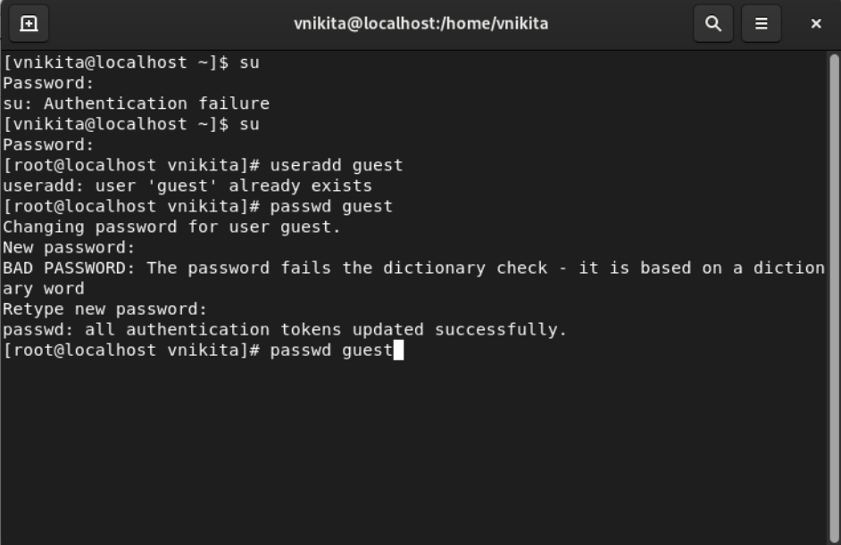

## Front matter
lang: ru-RU
title: Дискреционное разграничение прав в Linux. Основные атрибуты
subtitle:
author:
  - Венчаков Никита Юрьевич
institute:
  - Российский университет дружбы народов, Москва, Россия
date: 15 сентября 2022

## i18n babel
babel-lang: russian
babel-otherlangs: english

## Formatting pdf
toc: false
toc-title: Содержание
slide_level: 2
aspectratio: 169
section-titles: true
theme: metropolis
header-includes:
 - \metroset{progressbar=frametitle,sectionpage=progressbar,numbering=fraction}
 - '\makeatletter'
 - '\beamer@ignorenonframefalse'
 - '\makeatother'

## Fonts
mainfont: PT Serif
romanfont: PT Serif
sansfont: PT Sans
monofont: PT Mono
mainfontoptions: Ligatures=TeX
romanfontoptions: Ligatures=TeX
sansfontoptions: Ligatures=TeX,Scale=MatchLowercase
monofontoptions: Scale=MatchLowercase

---

## Докладчик

  * Венчаков Никита Юрьевич

  * студент 4 курса

  * Студенческий билет: 1032196697

  * группа НБИбд-01-19

  * Российский университет дружбы народов

  * [venchakov2001@gmail.com](mailto:venchakov2001@gmail.com)

    

---

## Введение
### Цель работы

Получение практических навыков работы в консоли с атрибутами файлов, закрепление теоретических основ дискреционного разграничения доступа в современных системах с открытым кодом на базе ОС Linux.

## Выполнение лабораторной работы

1. Запустил Virtual Box и вошел в свою учетную запись ([рис. №1](Скриншоты выполнения\Вход в учетную запись.png))
){ #fig:001 width=70% height=70% }

## Создание учетной записи "guest"
2. В установленной при выполнении предыдущей лабораторной работы
операционной системе создал учётную запись пользователя guest (использую учётную запись администратора) с помощью команды useradd guest. Также здесь задал пароль учетной записи "guest" при помощи команды passwd guest ([рис. №2](Скриншоты выполнения\Создание пользователя гость.png)) 
{ #fig:002 width=70% height=70% }

## Проверка имени пользователя
3. Уточнил имя пользователя командой whoami.([рис. №5](Скриншоты выполнения\Проверка имени пользователя.png))
   { #fig:003 width=70% height=70% }

## Уточнение признаков учетной записи
4. Уточнил имя пользователя,группу, а также группы, куда входит пользователь, командой id. Сравните вывод id с выводом команды groups. Обе команды показывают, что guest находится в группе guest. Сравнил полученную информацию об имени пользователя с данными, выводимыми в приглашении командной строки. Они совпадают, так как uid и gid равны 1001.([рис. №6](Скриншоты выполнения\id и groups гость.png))
   { #fig:004 width=70% height=70% }

## Просмотр прав директорий
5. Определил существующие в системе директории командой ls -l /home/ ([рис. №8](Скриншоты выполнения\Просмотр поддиректорий.png))
{ #fig:005 width=70% height=70% }

## Создание директории
6. Создал в домашней директории поддиректорию dir1 командой
mkdir dir1. Определил командами ls -l и lsattr, какие права доступа и расширенные атрибуты были выставлены на директорию dir1. Для dir1 стоят почти максимальные права, кроме права на изменение другими пользователями. ([рис. №10](Скриншоты выполнения\Папка dir1.png))
    { #fig:006 width=70% height=70% }

## Изменение прав директории
7. Снимим с директории dir1 все атрибуты командой chmod 000 dir1 ([рис. №11](Скриншоты выполнения\Снятие прав доступа с dir1.png))
    { #fig:007 width=70% height=70% }

## Попытка создания файла
8. Попытался создать в директории dir1 файл file1 командой 
echo "test" > /home/guest/dir1/file1, это не получилось, так как в прошлом пункте мы убрали все права доступа. При проверке файла разумеется нет в директории. При проверке файла разумеется нет в директории. Проверяли командой ls -l /home/guest/dir1 ([рис. №12](Скриншоты выполнения\Создание тестового файла.png))
    { #fig:008 width=70% height=70% }

## Вывод
Получил практические навыки работы в консоли с атрибутами файлов, закрепил теоретических основы дискреционного разграничения доступа в современных системах с открытым кодом на базе ОС Linux.
