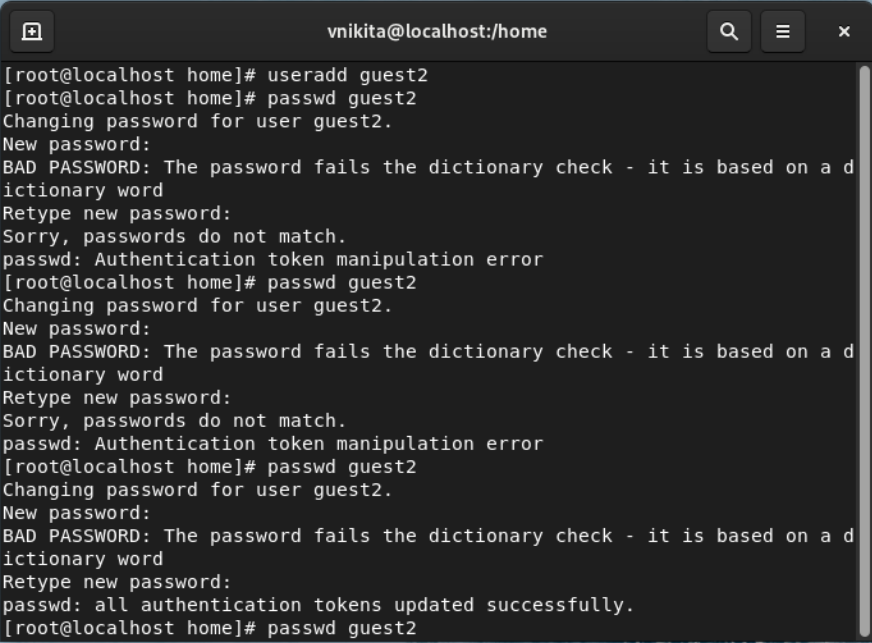

## Front matter
lang: ru-RU
title: Дискреционное разграничение прав в Linux. Два пользователя
subtitle:
author:
  - Венчаков Никита Юрьевич
institute:
  - Российский университет дружбы народов, Москва, Россия
date: 18 сентября 2022

## i18n babel
babel-lang: russian
babel-otherlangs: english

## Formatting pdf
toc: false
toc-title: Содержание
slide_level: 2
aspectratio: 169
section-titles: true
theme: metropolis
header-includes:
 - \metroset{progressbar=frametitle,sectionpage=progressbar,numbering=fraction}
 - '\makeatletter'
 - '\beamer@ignorenonframefalse'
 - '\makeatother'

## Fonts
mainfont: PT Serif
romanfont: PT Serif
sansfont: PT Sans
monofont: PT Mono
mainfontoptions: Ligatures=TeX
romanfontoptions: Ligatures=TeX
sansfontoptions: Ligatures=TeX,Scale=MatchLowercase
monofontoptions: Scale=MatchLowercase

---

## Докладчик

  * Венчаков Никита Юрьевич

  * студент 4 курса

  * Студенческий билет: 1032196697

  * группа НБИбд-01-19

  * Российский университет дружбы народов

  * [venchakov2001@gmail.com](mailto:venchakov2001@gmail.com)

    

---

## Введение
### Цель работы

Получение практических навыков работы в консоли с атрибутами файлов для групп пользователей.

## Выполнение лабораторной работы

1. В установленной операционной системе создал учётную запись пользователя guest2 (используя учётную запись администратора) спомощью команды user addguest2. Также здесь задал пароль учетной записи "guest" припомощи команды passwd guest2.([рис.№1](Скриншоты выполнения\Создание пользователя guest2.png))
{ #fig:001 width=70% height=70% }

## Запуск двух терминалов с разными учетными записями
2. Осуществил вход в систему от двух пользователей на двух разных консолях: guest на первой консоли и guest2 на второй консоли.([рис.№2](Скриншоты выполнения\ Две консоли с пользователями.png))
{ #fig:003 width=70% height=70% }

## Проверка атрибутов пользователей
3. Уточнил имя пользователя, его группу, кто входит в неё
и к каким группам принадлежит он сам. Определил командами groups guest и groups guest2, в какие группы входят пользователи guest и guest2.Сравнил вывод команды groups с выводомкоманд id -Gn и id-G.([рис.№3](Скриншоты выполнения\Проверка пользователей.png))
{ #fig:005 width=70% height=70% }

## Регистрация guest2 в группу guest
4. От имени пользователя guest2 выполнил регистрацию пользователя guest2 в группе guest командой newgrp guest([рис.№4](Скриншоты выполнения\регистрация в группу.png))
{ #fig:007 width=70% height=70% }

## Расширение прав на директорию
5. От имени пользователя guest изменил права директории /home/guest, разрешив все действия для пользователей группы командой: chmodg + rwx /home/guest ([рис.№5](Скриншоты выполнения\Добавление прав группе.png))

## Снятие прав
6. От имени пользователя guest снял с директории /home/guest/dir1 все атрибуты командой chmod 000 dirl. ([рис.№6](Скриншоты выполнения\Снятие прав с dir1.png))
{ #fig:009 width=70% height=70% }

## Минимальные права 
7. Заполнил таблицы на минимально необходимые и возможные действия прав доступа к директориям и файлам.
## Вывод
Получил практические навыки работы в консоли с атрибутами файлов для групп пользователей.