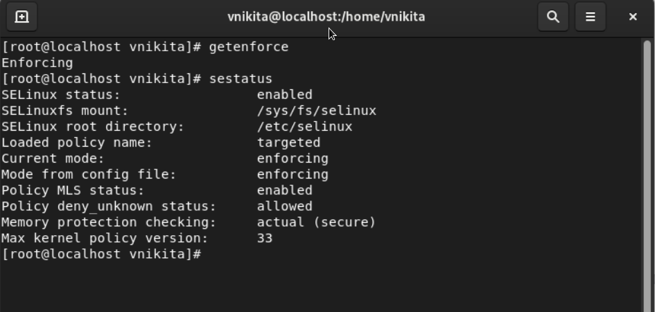

---
# Front matter
lang: ru-RU
title: "Отчёт по лабораторной работе №6"
subtitle: "Мандатное разграничение прав в Linux"
author: "Венчаков Никита НБИбд-01-19"

## Formatting
toc-title: "Содержание"
toc: true # Table of contents
toc_depth: 2
lof: true # List of figures
fontsize: 12pt
linestretch: 1.5
papersize: a4paper
documentclass: scrreprt
polyglossia-lang: russian
polyglossia-otherlangs: english
mainfont: PT Serif
romanfont: PT Serif
sansfont: PT Sans
monofont: PT Mono
mainfontoptions: Ligatures=TeX
romanfontoptions: Ligatures=TeX
sansfontoptions: Ligatures=TeX,Scale=MatchLowercase
monofontoptions: Scale=MatchLowercase
indent: true
pdf-engine: lualatex
header-includes:
  - \linepenalty=10 # the penalty added to the badness of each line within a paragraph (no associated penalty node) Increasing the value makes tex try to have fewer lines in the paragraph.
  - \interlinepenalty=0 # value of the penalty (node) added after each line of a paragraph.
  - \hyphenpenalty=50 # the penalty for line breaking at an automatically inserted hyphen
  - \exhyphenpenalty=50 # the penalty for line breaking at an explicit hyphen
  - \binoppenalty=700 # the penalty for breaking a line at a binary operator
  - \relpenalty=500 # the penalty for breaking a line at a relation
  - \clubpenalty=150 # extra penalty for breaking after first line of a paragraph
  - \widowpenalty=150 # extra penalty for breaking before last line of a paragraph
  - \displaywidowpenalty=50 # extra penalty for breaking before last line before a display math
  - \brokenpenalty=100 # extra penalty for page breaking after a hyphenated line
  - \predisplaypenalty=10000 # penalty for breaking before a display
  - \postdisplaypenalty=0 # penalty for breaking after a display
  - \floatingpenalty = 20000 # penalty for splitting an insertion (can only be split footnote in standard LaTeX)
  - \raggedbottom # or \flushbottom
  - \usepackage{float} # keep figures where there are in the text
  - \floatplacement{figure}{H} # keep figures where there are in the text
---

# Цель работы

Развить навыки администрирования ОС Linux. Получить первое практическое знакомство с технологией SELinux1.
Проверить работу SELinx на практике совместно с веб-сервером Apache.

# Выполнение лабораторной работы

1. Вошел в систему с полученными учётными данными и убедился, что SELinux работает в режиме enforcing политики targeted с помощью команд getenforce и sestatus.([рис.№1](Скриншоты выполнения\Пункт 1.png))
{ #fig:001 width=70% height=70% }

2. Обратился с помощью браузера к веб-серверу, запущенному на  компьютере, и убедился, что последний работает: service httpd status ([рис.№2](Скриншоты выполнения\Пункт 2.png))
{ #fig:002 width=70% height=70% }

3. Нашел веб-сервер Apache в списке процессов, определите его контекст безопасности. Использовал команду ps auxZ | grep httpd([рис.№3](Скриншоты выполнения\Пункт 3.png))
{ #fig:003 width=70% height=70% }

4. Посмотрел текущее состояние переключателей SELinux для Apache с
помощью команды sestatus -bigrep httpd ([рис.№4](Скриншоты выполнения\Пункт 4.png))
{ #fig:003 width=70% height=70% }

5. Посмотрел статистику по политике с помощью команды seinfo.([рис.№5](Скриншоты выполнения\Пункт 5.png))
{ #fig:005 width=70% height=70% }

6. Определил тип файлов и поддиректорий, находящихся в директории /var/www, с помощью команды ls -lZ /var/www([рис.№6](Скриншоты выполнения\Пункт 6.png))
{ #fig:006 width=70% height=70% }

7. Определил тип файлов, находящихся в директории /var/www/html: ls -lZ /var/www/html ([рис.№7](Скриншоты выполнения\Пункт 7 и 8.png))
{ #fig:007 width=70% height=70% }

8.  Определите круг пользователей, которым разрешено создание файлов в
директории /var/www/html. 

9. Создал от имени суперпользователя html-файл /var/www/html/test.html следующего содержания:
<html>
<body>test</body>
</html>
([рис.№8](Скриншоты выполнения\Пункт 9.png))
{ #fig:008 width=70% height=70% }

10. Проверил контекст созданного файла. ([рис.№9](Скриншоты выполнения\Пункт 10.png))
{ #fig:009 width=70% height=70% }

11. Обратился к файлу через веб-сервер, введя в браузере адрес
http://127.0.0.1/test.html. Убедился, что файл был успешно отображён. ([рис.№10](Скриншоты выполнения\Пункт 11.png))
{ #fig:010 width=70% height=70% }

12. Изучил справку man httpd_selinux и выясните, какие контексты файлов определены для httpd.

13. Изменил контекст файла /var/www/html/test.html с httpd_sys_content_t на любой другой, к которому процесс httpd не должен иметь доступа, например, на samba_share_t:
chcon -t samba_share_t /var/www/html/test.html, ls -Z /var/www/html/test.html ([рис.№11](Скриншоты выполнения\Пункт 13.png))
{ #fig:011 width=70% height=70% }

14. Попробовал ещё раз получить доступ к файлу через веб-сервер, введя в
браузере адрес http://127.0.0.1/test.html. ([рис.№12](Скриншоты выполнения\Пункт 14.png))
{ #fig:012 width=70% height=70% }

15. Проанализировал ситуацию команду ls -l /var/www/html/test.html
Просмотрел log-файлы веб-сервера Apache. Также просмотрел системный лог-файл:
tail /var/log/messages ([рис.№12](Скриншоты выполнения\Пункт 15.png))
{ #fig:012 width=70% height=70% }

16. Попробовал запустить веб-сервер Apache на прослушивание ТСР-порта 81 .Для этого в файле /etc/httpd/httpd.conf найдите строчку Listen 80 и заменил её на Listen 81.
([рис.№13](Скриншоты выполнения\Пункт 16.png))
{ #fig:013 width=70% height=70% }
 

17. Выполнил перезапуск веб-сервера Apache([рис.№13](Скриншоты выполнения\Пункт 17.png))
{ #fig:013 width=70% height=70% }

18. Проанализировал лог-файлы: tail -nl /var/log/messages ([рис.№14](Скриншоты выполнения\Пункт 18.png))
{ #fig:014 width=70% height=70% }

19. Выполнил команду semanage port -a -t http_port_t -р tcp 81
После этого проверьте список портов командой semanage port -l | grep http_port_t ([рис.№15](Скриншоты выполнения\Пункт 19.png))
{ #fig:014 width=70% height=70% }

20. Попробовал запустить веб-сервер Apache ещё раз.

21. Вернул контекст httpd_sys_cоntent__t к файлу /var/www/html/ test.html:
chcon -t httpd_sys_content_t /var/www/html/test.html После этого попробуйте получить доступ к файлу через веб-сервер, введя в браузере адрес http://127.0.0.1:81/test.html.

22. Исправил обратно конфигурационный файл apache, вернув Listen 80.

23. Удалил привязку http_port_t к 81 порту: semanage port -d -t http_port_t -p tcp 81 и проверил, что порт 81 удалён.

24. Удалил файл /var/www/html/test.html: rm /var/www/html/test.html ([рис.№16](Скриншоты выполнения\Последние пункты.png))
{ #fig:014 width=70% height=70% }

# Вывод

Развил навыки администрирования ОС Linux. Получил первое практическое знакомство с технологией SELinux1. Проверил работу SELinx на практике совместно с веб-сервером Apache.